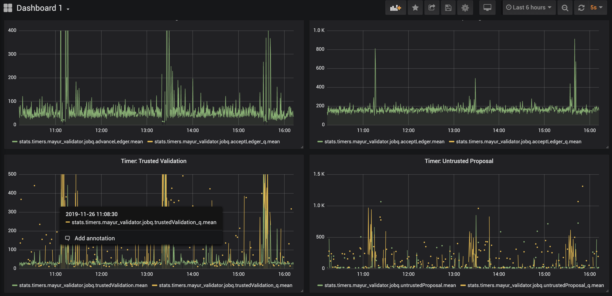
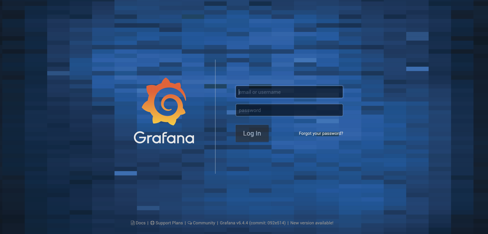

# rippledmon
Keep an eye on your rippled server with this drop-in monitoring solution.


# Background
[rippled](https://github.com/ripple/rippled) is equipped to export metrics via statsd when "insights" are enabled. This monitoring tool consumes and presents those metrics via statsd-graphite and Grafana docker containers. New versions of rippled will export more metrics and new dashboards will be added to this repository. 




# Prerequisites 
Docker and docker-compose must be installed on your system. For more details on this see [here](https://docs.docker.com/install/) for docker and [here](https://docs.docker.com/compose/install/) for docker-compose.


# Installation

1. Clone this repo and start the docker containers with docker-compose

```
$ git clone https://github.com/mayurbhandary/rippledmon.git
$ cd rippledmon
$ docker-compose up
```

2. Add the [insight] stanza to your rippled.cfg file, and restart your rippled server.

```
[insight]
server=statsd
address=127.0.0.1:8125
prefix=my_rippled
```

This will enable insights on your rippled server and send metrics via UDP to a statsd server listening on port 8125 of your localhost. The metrics will be prefixed with 'my_rippled'

3. Login to Grafana and view dashboards

```
In your browser go to http://localhost:3000 
```


The default username and password are 'admin'

# Current Metrics


